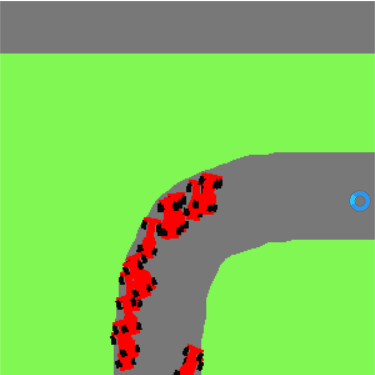

# Car Racing Environment for Reinforcement Learning

A simple environment for allowing an agent learn to become better through reinforcement learning.

Set up your configurations in the config.py file, and use however you want :)

This environment is made to closely replicate the CarRacing-v0 Environment in OpenAI gym. However, since that environment doesn't support multiple instances of cars, I decided to make my own!

## Demo

Random Agent on the environment.

## Making a new map

To make a new map, do the following:
- Create a new png image of dimensions 1500x1500 
- Fill the image with a grass colour of your choice
- Use the eraser tool and draw out your track
- Save and replace the track.png with a new image of dimensions 1500x1500
- Modify the starting position by changing the value in the `environment.py` file.
- Make sure you have atleast 150 pixels gap between tracks so that the distance checker doesn't mess up.
    - This has been done as a tradeoff between speed of detection vs track size. We can always increase the size of the environment to have larger curves, but speed would be lower if the constraint isn't added.

